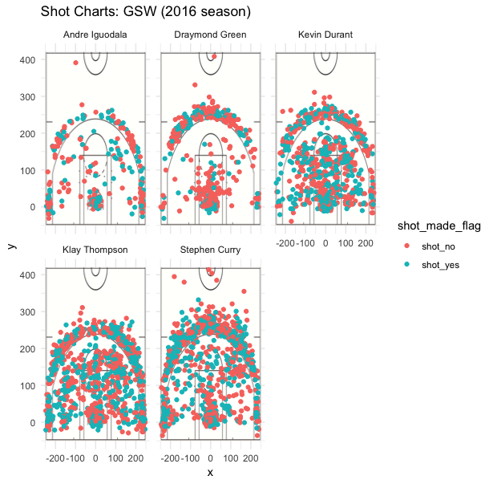

```{r setup, include=FALSE}
knitr::opts_chunk$set(echo = TRUE)
```

```{r, include=FALSE}
dataframe = read.csv("../data/shots-data.csv")
library(dplyr)
library(gridExtra)
```

## Introduction and Background

The Golden State Warriors is a professional basketball team based in Oakland, California. They are part of the Western Conference Pacific Division and play games with other teams in the National Basketball Association. Their current roster consists of 17 players, many of whom are famous worldwide. 

In basketball, teams move the ball down the court by passing or dribbling it. They score points by shooting the ball into the hoop on the opposite side of the court. Players can score one, two, or three points at a time. Free throws are awarded when the opposing team commits a foul or several fouls. The player can be given several free throws; for example, if the player makes the first free throw, they can try a second one. Each successful free throw is worth one point. On the basketball court, an arc called the “three-point arc” is the boundary for baskets worth three points. Since it is more difficult to make a basket from outside the three-point arc, these throws are worth more. 

Each basketball game is divided into two halves. In professional basketball, each half is divided into half again, and each quarter is 12 minutes long. Essentially, players have 48 minutes to score as many points as they can to win the game. If the score is tied at the end of the game, then the game goes into overtime. 

Sports analysts follow these basketball games closely, analyzing every basket and every point scored. They also analyze the players’ skill by looking at how many shots they take, and what percentage of shots they actually make. 

In this report, I will examine the data of five players in the Golden State Warriors: Andre Iguodala, Draymond Green, Kevin Durant, Klay Thompson, and Stephen Curry. Using data from the 2016 basketball season, I will analyze each player’s shots to determine the effectiveness and skill of each player. 

## Code

```{r}
twopt_yes = filter(dataframe, shot_type == "2PT Field Goal" & shot_made_flag == "shot_yes")
twopt_yes = select(twopt_yes, name, shot_made_flag)
twopt_yes = count(twopt_yes, name, shot_made_flag)
twopt_yes = twopt_yes %>% rename(made = n)
twopt_yes = select(twopt_yes, name, made)
twopt_no = filter(dataframe, shot_type == "2PT Field Goal" & shot_made_flag == "shot_no")
twopt_no = select(twopt_no, name, shot_made_flag)
twopt_no = count(twopt_no, name, shot_made_flag)
twopt_no = twopt_no %>% rename(missed = n)
twopt_no = select(twopt_no, name, missed)
```

```{r}
twopt = merge(twopt_yes, twopt_no, by = "name")
twopt$total = twopt$made + twopt$missed
twopt$perc_made = twopt$made / twopt$total
twopt = select(twopt, name, total, made, perc_made)
table1 = twopt[with(twopt, order(-perc_made)), ]
```

```{r}
threept_yes = filter(dataframe, shot_type == "3PT Field Goal" & shot_made_flag == "shot_yes")
threept_yes = select(threept_yes, name, shot_made_flag)
threept_yes = count(threept_yes, name, shot_made_flag)
threept_yes = threept_yes %>% rename(made = n)
threept_yes = select(threept_yes, name, made)
threept_no = filter(dataframe, shot_type == "3PT Field Goal" & shot_made_flag == "shot_no")
threept_no = select(threept_no, name, shot_made_flag)
threept_no = count(threept_no, name, shot_made_flag)
threept_no = threept_no %>% rename(missed = n)
threept_no = select(threept_no, name, missed)
```

```{r}
threept = merge(threept_yes, threept_no, by = "name")
threept$total = threept$made + threept$missed
threept$perc_made = threept$made / threept$total
threept = select(threept, name, total, made, perc_made)
table2 = threept[with(threept, order(-perc_made)), ]
```

```{r}
total_yes = filter(dataframe, shot_made_flag == "shot_yes")
total_yes = select(total_yes, name, shot_made_flag)
total_yes = count(total_yes, name, shot_made_flag)
total_yes = total_yes %>% rename(made = n)
total_yes = select(total_yes, name, made)
total_no = filter(dataframe, shot_made_flag == "shot_no")
total_no = select(total_no, name, shot_made_flag)
total_no = count(total_no, name, shot_made_flag)
total_no = total_no %>% rename(missed = n)
total_no = select(total_no, name, missed)
```

```{r}
totaltbl = merge(total_yes, total_no, by = "name")
totaltbl$total = totaltbl$made + totaltbl$missed
totaltbl$perc_made = totaltbl$made / totaltbl$total
totaltbl = select(totaltbl, name, total, made, perc_made)
table3 = totaltbl[with(totaltbl, order(-perc_made)), ]
```

## Data

2PT Effective Shooting Percentage by Player

```{r, echo=FALSE}
table1
```


3PT Effective Shooting Percentage by Player

```{r, echo=FALSE}
table2
```

Overall Effective Shooting Percentage by Player

```{r, echo=FALSE}
table3
```

GSW Shot Charts

```{r out.width="80%", echo = FALSE, fig.align="center"}

```

## Analysis

There are two types of data in this report: effective shooting percentage and shot charts. The first one is divided into two-point, three-point, and overall effective shooting percentage. This data shows each player’s total number of shots in the 2016 season, how many shots were made, and the percentage made. The second type of data, the shot chart, shows the physical location on the court from which each shot was made. It displays successful shots in blue and unsuccessful shots in red. 

### 2PT Effective Shooting Percentage by Player

This data is on two-point throws, ordered in descending order by percentage of shots made. Andre Iguodala topped the list with 63.8% of shots made, and Draymond Green had the lowest percentage of shots made (49.2%). Kevin Durant made the largest number of total shots and Andre Iguodala made the least. Kevin Durant also made the largest number of successful shots and, again, Iguodala made the least. This data is interesting because there is not a strong correlation, positive or negative, between the number of shots and the percentage of shots. In the case of Iguodala’s shots, one could infer that the reason he had such a high percentage of successful shots was that he was more picky about what shots he attempted. Perhaps, he was more likely than the other players to pass the ball to another player if he was not as certain he could make the basket. 

### 3PT Effective Shooting Percentage by Player

This data is on three-point throws, ordered in descending order by percentage of shots made. Klay Thompson had the highest percentage with 42.4%, while Draymond Green had the lowest percentage with 31.9%. Stephen Curry made the largest number of both total and successful shots, and Andre Iguodala made the smallest number of both total and successful shots. This data supports the hypothesis that Iguodala is averse to attempting tricky shots. In contrast, Stephen Curry seems to take every opportunity to attempt a shot. Because three-pointers must be made from outside the three-point arc, this data also reveals the ability of each player to throw accurately from long distances. 

### Overall Effective Shooting Percentage by Player

This data is on overall throws, ordered in descending order by percentage of shots made. Kevin Durant has the highest percentage made (54.1%) and Draymond Green has the lowest (42.4%). Stephen Curry, again, made the largest number of both total and successful shots, and Andre Iguodala, again, made the smallest number of both total and successful shots. This data also supports the hypothesis stated in the previous two sections.

### GSW Shot Charts

This data is a visualization of where each shot was made on the court, and whether each shot was successful or unsuccessful. The visualization makes it easier for the reader to see who attempted the most shots, and who had the most accuracy. By separating made and missed shots by color, the chart highlights the two distinct categories. Draymond Green seems to prefer attempting shots from either right next to the basket, or from past the three-point arc. On the other hand, the other players have a more even distribution. Stephen Curry seems the most comfortable with making shots from far past the three-point arc, which is confirmed by the three-point data table. 

The downside of visualizing the data in this format is that it shows shot location, not shot success rates. Since the percentages made by each player are so close to each other--often only a few percentage points apart--using graphics and colors to depict them is not as accurate or useful as using raw numbers. 

## Conclusions

The important takeaway from this data is that a basketball player’s skill cannot be measured by only one metric. Some players are better suited for three-point throws, while others are better at 2-point throws. Some prefer to attempt fewer shots with a higher rate of success, while others aim for overall number and attempt as many shots as possible. Lastly, some players are better at long-range shots than close-range shots and vice versa. Each Golden State Warriors player in the data analyzed has his strong suits and weaknesses. 
